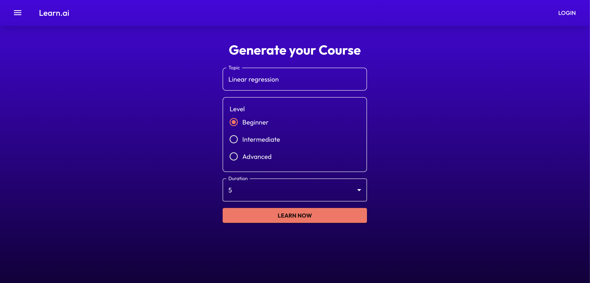
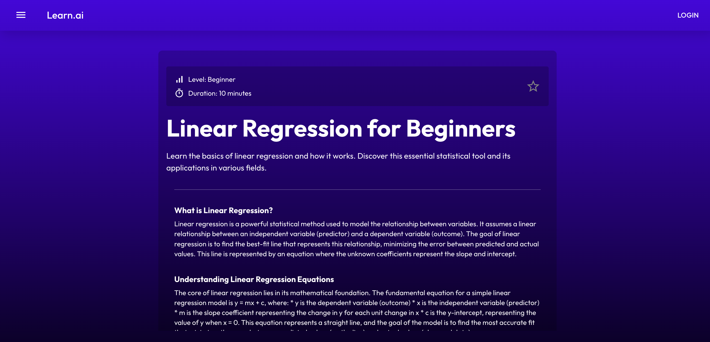

# Learn.ai - Course Generator

A simple web app designed to make learning easier by generating personalized courses using a LLM workflow.


## Tech Stack
- **Frontend:** React/Next.js, TypeScript
- **Backend:** FastAPI, Python
- **Database:** PostgreSQL
- **Containerization:** Docker
- **AI:** Ollama with Gemma language model


## Architecture
- Each service runs in its own Docker container.  
- Nginx acts as a reverse proxy, routing traffic to the correct service.  
- The project is configured to serve all traffic over HTTPS for secure connections.


1. **Installation**
```bash
git clone https://github.com/lorene-k/learn-ai.git
cd learn-ai/app
```

2. **Env setup**
```bash
cp .env.example .env
cp backend/.env.example backend/.env
```
- *Add environment variables to .env files before running.*

3. **Run project**
```bash
make
```
- *On macOS, this starts the app and other services in Docker while connecting to your local Ollama.*
- *On Linux, this starts all services including the Ollama container.*


4. **Access website at:**
> https://localhost
- *The HTTPS connection uses a self-signed certificate: your browser may show a security warning.*


## Screenshots

### Home page  


### Course page  


### History page
